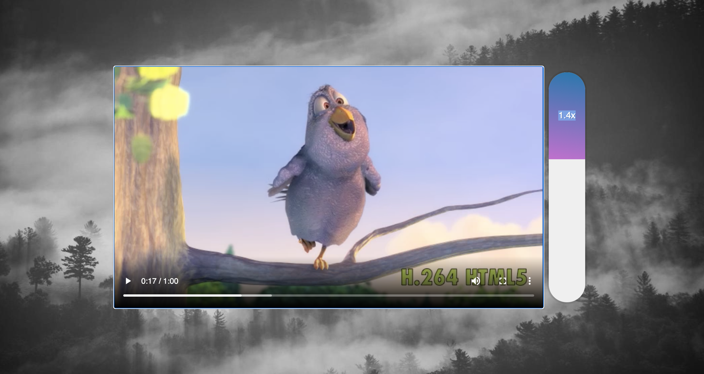

# Video Speed Controller
Day 28 of Javascript30 by WesBos. Made a video player site, all the basic functions of a video player is available. It also has a video playrate range option.

# Demo

# Technologies Used
HTML5, CSS, Vanilla JS

# Website
https://buigabor.github.io/Click-and-Drag/